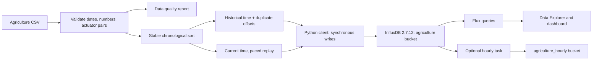

# Course guide: exploring InfluxDB with agriculture IoT observations

## 1. Project objective and scope

**Suggested title:** Exploring Time-Series Storage and Analytics with InfluxDB: An Agriculture IoT Case Study.

Demonstrate that you can design a time-series schema, ingest imperfect observations reliably, query time windows, visualize trends, and explain duplicate-point and retention behavior. The implementation uses InfluxDB OSS **2.7.12**, Python **3.12**, and Flux. It is a database exploration project using simulated arrival of recorded observations.

Course-specific requirements are still pending: confirm the required database version, report/slides/demo deliverables, and marking rubric before treating this as a final submission. The user has indicated requirements exist, but their details have not yet been supplied.

Suggested research questions:

1. How do measurements, tags, fields, and timestamps represent IoT observations?
2. How do timestamp precision and duplicate source dates affect stored counts?
3. How do windowed queries turn raw observations into useful summaries?
4. How do batching and retention affect an ingestion workflow?

## 2. Architecture



The Python process runs on your host. Docker runs the database, API, UI, and task scheduler. Named volumes retain data when the container stops. No MQTT broker, Telegraf, Grafana, or external cloud account is required for this scope.

## 3. Understand the data before importing

Run:

```bash
uv sync --locked
uv run influx-profile --output reports/dataset-profile.json
```

Verified values from the included CSV under the default UTC assumption:

| Property | Value |
| --- | --- |
| Total CSV records | 37,922 |
| Valid observations | 37,920 |
| Invalid records | Missing dates on CSV lines 14,351 and 14,352 |
| Earliest source time | 2023-11-27 06:26:00 |
| Latest source time | 2024-03-30 05:24:00 |
| Unique source timestamps | 28,682 |
| Extra observations sharing timestamps | 9,238 |
| Repeated timestamp groups | 2,972, all with differing field values |
| Backward time steps in file order | 3,067 |
| Most common gap between unique timestamps | 300 seconds; other gaps also occur |

Do not describe this as a regular February–August 2024 stream. File order is not chronological. No device identifiers or timezone metadata are present. The repository also lacks an authoritative source URL, license statement, and units specification. Add those from the original dataset provider before submitting the report; do not infer them from the filename. In particular, do not claim nutrient units, water-level units, or sensor calibration from the numeric values alone.

Validation rejects missing/bad dates, missing/non-finite numeric values, malformed rows, and inconsistent binary ON/OFF pairs. By default invalid records are reported and skipped; `--strict` stops before any write. The unmodified CSV remains the source artifact.

### Timestamp policy

Dates are interpreted as UTC by default. If the dataset documentation identifies another timezone, pass `--source-timezone Asia/Ho_Chi_Minh` (or the documented IANA zone). Changing that assumption changes stored historical times; use a separate bucket when comparing interpretations. The bundled historical query range assumes UTC and may need widening for another timezone.

Historical mode sorts by source time, keeps CSV order within equal timestamps, and assigns successive nanosecond offsets to conflicting observations. For this dataset the largest offset is 9 ns. `source_time_ns` retains the original timestamp, and `source_row` identifies the CSV line. Reimporting the same file and settings overwrites the same point identities, so the count stays **37,920**. Reordering/editing the source can change this identity mapping; import changed datasets into a separate bucket.

Live mode gives each observation a current nanosecond timestamp, increasing it if the local clock stalls or moves backwards. Use one replay process per series; this is not a distributed timestamp allocator. Live replay compresses source history into the chosen playback rate and must not be interpreted as the original elapsed sensor time.

InfluxDB identifies a point by measurement, tag set, and timestamp. Rewriting that identity merges field sets and replaces matching field values. See the [official duplicate-point behavior](https://docs.influxdata.com/influxdb/v2/write-data/best-practices/duplicate-points/).

## 4. Start the database

From the project directory:

```bash
if [ ! -s .env ]; then cp .env.example .env; fi
uv sync --locked
docker compose up -d --build --wait
docker compose ps
curl -fsS http://localhost:8086/health
```

Open <http://localhost:8086> and log in with the local demo username `admin` and password `admin-password-123`. The default organization is `my-org`, bucket `agriculture`, token `my-token`. These defaults support a local classroom demo; the Compose port binds to localhost. `.env` is excluded from Git.

The image is pinned to `influxdb:2.7.12` to match the verified server and avoid a major-version change. This is an explicit teaching version, not a claim that 2.7.12 is the latest release. The [v2 installation guide](https://docs.influxdata.com/influxdb/v2/install/) explains Docker initialization.

Compose loads `.env` automatically. Python commands load it with `uv run --env-file .env`. Command-line connection flags override environment values, which override local demo defaults. If a shell already exports `INFLUXDB_*` variables, check that they match the intended environment.

Initialization variables only apply to empty database volumes. Existing installations keep their original organization, credentials, bucket, and retention. This configuration uses unlimited raw-data retention (`0`) so the historical observations are accepted.

```bash
# Stop and resume while keeping all data.
docker compose stop
docker compose start

# Follow server logs; Ctrl+C stops following, not the server.
docker compose logs -f influxdb
```

Do not use `docker compose down -v` as routine troubleshooting: it deletes project volumes. If port 8086 is occupied by an unrelated service, change both `INFLUXDB_PORT` and `INFLUXDB_URL` in `.env`. A container already named `influxdb` outside this Compose project requires choosing another `container_name` first.

## 5. Ingest and verify

### Offline preview

```bash
uv run influx-replay --dry-run --preserve-time --interval 0 --max-rows 3
uv run influx-replay --help
```

The preview prints line protocol without connecting to InfluxDB. All source records are validated before the first write, even if `--max-rows` is small.

### Full historical import

```bash
uv run --env-file .env influx-replay --preserve-time --interval 0 --batch-size 500
uv run --env-file .env influx-query queries/02_historical_count.flux
```

Expected count for a clean bucket: **37,920**. Run the same import and query again; the count should remain unchanged. Count just the `temperature` field, which exists in every accepted observation. An unfiltered Flux `count()` returns counts per table/field; it is not automatically a single observation count.

`--batch-size 500` sends synchronous batches, including the final partial batch. The completion message reports acknowledged points and local elapsed write time. It is not a database benchmark or an independent stored-count check. A failure or interruption can leave previously acknowledged batches stored; historical replay can be rerun safely with the same file/settings. There is no automatic retry of ambiguous failed requests.

### Live replay

```bash
uv run --env-file .env influx-replay --interval 1 --max-rows 120
# Or repeat the dataset until Ctrl+C:
uv run --env-file .env influx-replay --interval 1 --loop
```

Open the UI during replay and use the last 30 minutes. The process delays between observations, so the actual rate also includes synchronous write latency. `--max-rows` is a total limit across loops. `--loop --preserve-time` is rejected because it would continually overwrite identical history.

A fast integrity check:

```bash
uv run --env-file .env influx-replay --interval 0 --max-rows 100
```

Nanosecond precision prevents rows within the same second from collapsing. Live imports append new point identities; they are intentionally not idempotent across reruns.

### Schema

| Concept | Project mapping | Reason |
| --- | --- | --- |
| Organization | `my-org` | Groups project resources |
| Bucket | `agriculture` | Stores raw data with its retention policy |
| Measurement | `agriculture` | Common observation schema |
| Tag | `source=iot-agriculture-2024` | Low-cardinality dataset identity |
| Tag | `mode=historical` or `mode=live` | Separates history from demonstration playback |
| Float fields | `temperature`, `humidity`, `water_level`, `nitrogen`, `phosphorus`, `potassium` | Sensor values |
| Float fields | `fan_on/off`, `watering_pump_on/off`, `water_pump_on/off` | Six 0/1 actuator state values |
| Integer fields | `source_row`, `source_time_ns` | Provenance without a tag per row |
| Timestamp | `_time` | Query time axis under the selected policy |

The source spelling `tempreature` becomes `temperature`, and `N/P/K` become named nutrient fields. All twelve observation fields are floats to keep their types consistent; provenance fields are integers. Do not run `mean()` across mixed field types without filtering to the intended sensor fields.

Tags provide indexed metadata in InfluxDB v2. Avoid a unique row identifier as a tag: it expands series cardinality. This project has only two tag sets for the default measurement. The [schema design recommendations](https://docs.influxdata.com/influxdb/v2/write-data/best-practices/schema-design/) explain field/tag choices.

## 6. Query exercises and dashboard

Run any read-only query with:

```bash
uv run --env-file .env influx-query queries/03_hourly_history.flux
# Export annotated CSV for a report figure or spreadsheet.
uv run --env-file .env influx-query queries/03_hourly_history.flux > reports/hourly-history.csv
```

The query runner substitutes the configured bucket into the supplied query files. Files otherwise use the default `agriculture` measurement. For a custom measurement, edit the filters as well.

| File | Demonstrates | Suggested UI visualization |
| --- | --- | --- |
| `01_live_trends.flux` | Last 30 minutes, one-minute temperature/humidity means | Line graph; separate cells if units differ |
| `02_historical_count.flux` | Count accepted historical observations | Single stat |
| `03_hourly_history.flux` | Hourly historical sensor means | Line graph |
| `04_threshold_events.flux` | Pivot fields into observations, then filter | Table |
| `05_actuator_fraction.flux` | Daily mean of binary ON samples | Line graph with 0–1 scale |
| `06_latest_live.flux` | Latest sensor values per field | Table or one single-stat cell per field |

In the InfluxDB UI:

1. Open **Data Explorer → Script Editor** and paste a query file. If you changed the bucket, edit its `bucket` variable.
2. Submit and choose the visualization. Queries 02–05 use fixed historical dates; 01 and 06 use the last 30 minutes.
3. Use **Save As** to save the cell to a dashboard named **Agriculture IoT Exploration**.
4. Add cells for historical trends, historical count, latest live temperature, and actuator fraction. Filter to one `_field` when a single-stat cell expects one value.
5. Keep live replay running and enable dashboard refresh (for example, 5 seconds). Capture one history screenshot and one updating-live screenshot for your submission.

`aggregateWindow` summarizes each window; `createEmpty: false` omits empty windows. Means here weight observations equally, including repeated source dates. They are not time-weighted statistics. Likewise, mean of binary ON observations is the **fraction of samples ON**, not a time-weighted duty cycle under irregular sampling. See the [Flux aggregateWindow reference](https://docs.influxdata.com/flux/v0/stdlib/universe/aggregatewindow/).

The threshold query uses `temperature > 35` or `water_level < 20` as illustrative conditions. They are not validated plant-care thresholds, and the query does not send notifications or control actuators.

## 7. Optional retention and downsampling lab

Use this extension if the rubric expects task scheduling or data lifecycle management:

1. In **Load Data → Buckets**, create `agriculture_hourly` with 365-day retention. Keep the raw historical bucket unlimited.
2. Open **Tasks → Create Task → Advanced/Flux editor**, paste `queries/07_downsample_task.flux`, and create the task. Adjust the raw bucket, destination bucket, and organization for custom settings.
3. Run live replay. The task runs hourly with a five-minute offset, summarizes the last two **completed** clock hours, and writes their sensor means to the summary bucket.
4. Inspect task run logs and query the destination bucket. The overlap rewrites stable window identities and can incorporate readings arriving within the two-hour lookback.

The task does not backfill 2023/2024 history. An immediate manual run can legitimately produce no data until there is a completed hour containing live observations. A 365-day target retention would reject old historical output today; use unlimited retention and a fixed historical range if deliberately implementing a backfill.

```flux
from(bucket: "agriculture_hourly")
  |> range(start: -1d)
  |> filter(fn: (r) => r._measurement == "agriculture")
```

A separate short-retention live bucket plus a longer-retention summary bucket is a possible extension. Do not apply short retention to the bucket containing the course's historical evidence. Read the [InfluxDB task introduction](https://docs.influxdata.com/influxdb/v2/process-data/get-started/) for scheduler behavior. The integration test checks the task's query/write operation with a controlled historical time; it does not wait for the real hourly scheduler.

## 8. Experiments and acceptance checks

```bash
uv run python -m unittest discover -s tests -v
uv build
docker compose config --quiet
uv run --env-file .env python tests/integration_check.py
```

The integration script needs create/delete-bucket privileges. It creates uniquely named test buckets, imports the supplied CSV twice, queries results, checks the task write path, and deletes only its own buckets. It leaves the user's `agriculture` bucket untouched. Evidence is written to `reports/integration-results.json` after success. An abrupt process kill may leave a bucket named `course-check-*`; inspect before removing it.

| Experiment | Expected result | What to discuss |
| --- | --- | --- |
| Profile CSV | 37,920 valid, two invalid | Data quality before ingestion |
| Rapid replay, batch size 5, 13 rows | 13 stored live observations | Precision and final partial batch |
| Full history import | 37,920 observations | Duplicate readings are preserved |
| Repeat identical history import | Still 37,920 | Point identity and idempotency |
| Mean temperature | Matches Python calculation from accepted rows | Query correctness |
| Same measurement/tags/time, two values | One point, newer matching field wins | Native duplicate-point semantics |
| Six read-only query files | All return results on populated test bucket | Filters, windows, pivot, last, count |
| Downsample query with controlled time | Aggregates stored in temporary target | Task query/write path |

Optional performance experiment: write the same fixed 5,000-observation historical subset with batch sizes 1, 100, and 500 into separate empty test buckets. Run each configuration three times, query the stored count, and report median time plus machine/server versions. Use `--interval 0`; otherwise pacing dominates. Do not claim a universal write rate from one local run.

## 9. Report outline and live presentation

Suggested report sections:

1. **Problem and objectives:** time-series characteristics and the four research questions.
2. **Technology scope:** InfluxDB v2, bucket/measurement/tag/field model, timestamp identity, Flux. Explain why the project pins this version.
3. **Dataset and provenance:** original citation/license once confirmed, measured profile, units/timezone limitations, duplicate policy.
4. **Design and implementation:** architecture diagram, schema table, validation, live and historical modes, batching.
5. **Experiments:** commands, expected/observed counts, mean cross-check, overwrite demonstration, local performance only if measured.
6. **Results:** dashboard screenshots and interpretation of trends; distinguish measured findings from assumptions.
7. **Limitations and extensions:** recorded replay, no physical sensor integration, unknown dataset metadata, artificial nanosecond offsets, no distributed ingestion coordination, optional tasks/alerts.
8. **Conclusion and references:** answer the research questions with your evidence.

Suggested 8–10 minute demo:

- **Minute 0–1:** introduce the objective and architecture.
- **Minute 1–2:** show the data profile and explain the timestamp problem.
- **Minute 2–4:** import history, show count 37,920, rerun, and show unchanged count.
- **Minute 4–6:** show hourly trends, pivot/threshold table, and sample-based actuator fraction.
- **Minute 6–8:** start live replay and show refreshed dashboard values.
- **Minute 8–10:** explain retention/downsampling and limitations; show test evidence.

Prepare history before the presentation so you can continue if the live import is interrupted. Submit source, lockfile, Compose files, guide/report, evidence JSON, screenshots, and slides if the rubric requires them. Never claim dashboard screenshots, scheduled task runs, or performance experiments were completed until you capture them yourself.

## 10. Troubleshooting

| Symptom | Likely cause and action |
| --- | --- |
| Package build cannot find `src/influxdb_explore` | Use this corrected checkout and run `uv sync --locked`; `uv build` now verifies the package layout. |
| Old `VIRTUAL_ENV` points elsewhere | Deactivate the unrelated environment and use project `uv run`; avoid `--active`, which selects that other environment. |
| Missing CSV in a wheel installation | Run from this editable checkout, or pass `--csv /absolute/path/to/IoTProcessed_Data.csv`. The dataset is not bundled in the wheel. |
| Connection refused | Check `docker compose ps`, logs, health endpoint, and `.env` URL/port. |
| Unauthorized or missing bucket | Existing-volume credentials may differ; inspect the UI and set matching configuration. Do not delete volumes to fix a token mismatch. |
| Historical query returns no data | Use the fixed November 2023–March 2024 range and `mode=historical`; check bucket retention. |
| Historical count exceeds 37,920 | Check for earlier imports with different timezone/file contents or extra tag sets; test in a fresh named bucket. |
| Old data disappears from new queries | New queries filter the `mode` tag; points written by the old script have no such tag. Reimport history with the new script. |
| Strict mode fails on supplied CSV | Expected: two source records have empty dates. Default mode reports/skips them. |
| Live dashboard is empty | Start replay and use a recent range; old live observations fall outside the last 30 minutes. |
| Task target is empty | Create its destination bucket and wait for a completed hour with live data; inspect task logs. |
